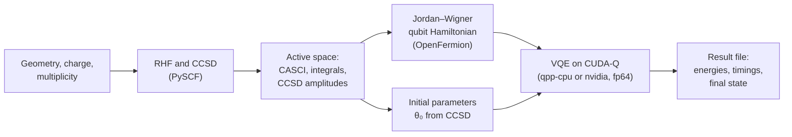
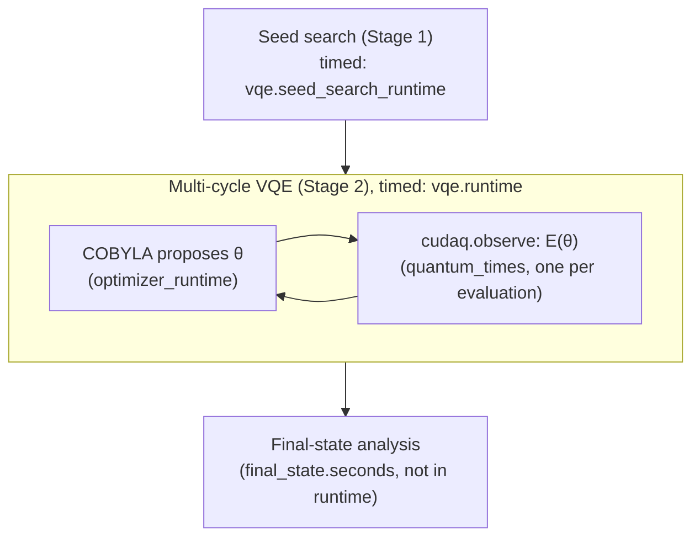

# Methods and their implementation

This document follows the Materials and Methods section of the paper *Acceleration of
molecular ground-state energy estimation with the variational quantum eigensolver using
CUDA-Q* and its Supporting Information (SI). For each equation it gives the code that
evaluates it. Symbols and equation labels are those of the paper; atomic units (Hartree)
are used for energies and ångström for coordinates.

| Symbol | Meaning |
|---|---|
| $`N_e^{(\mathrm{total})}`$ | total number of electrons of the molecule |
| $`N_o^{(\mathrm{total})}`$ | number of spatial molecular orbitals in the basis set ($`M_1`$ for cc-pVDZ) |
| $`N_o^{(c)}`$ | number of frozen-core (doubly occupied) orbitals; `ncore` in the code |
| $`N_e^{(a)}, N_o^{(a)}`$ | active electrons and active orbitals; `nele_cas`, `norb_cas` |
| $`N_q = 2N_o^{(a)}`$ | number of qubits (one per active spin orbital) |
| $`o = N_e^{(a)}/2,\quad  v = N_o^{(a)} - o`$ | occupied and unoccupied active orbitals per spin |
| $`p,q,r,s`$ | indices of any orbital (occupied or unoccupied), used in the Hamiltonian |
| $`i,j`$ and $`a,b`$ | indices of occupied and of unoccupied orbitals, used in the excitation operators and CCSD amplitudes |
| $`\boldsymbol{\theta}`$, $`\boldsymbol{\theta}_0`$ | UCCSD parameters and their CCSD-based initial values |

## 1. Materials: target molecules

The twelve closed-shell molecules of Table 1 of the paper are defined in
`vqe_cudaq/molecules.py` (geometry, charge, spin multiplicity, electron and orbital counts,
source of the geometry, and the nine active spaces). The same geometries are provided as
XYZ files in `geometries( xyz_files)/`; `vqe_cudaq/xyz.py` converts geometries given in
bohr to ångström (1 bohr = 0.529177210903 Å).

| Molecule | Label | $`N_e^{(\mathrm{total})}`$ | $`M_1`$ (cc-pVDZ) | Charge | Geometry |
|---|---|---|---|---|---|
| Ethylene | ET | 16 | 48 | 0 | NIST CCCBDB |
| Benzene | BZ | 42 | 114 | 0 | NIST CCCBDB |
| Naphthalene | NT | 68 | 180 | 0 | NIST CCCBDB |
| Tetracene | TC | 120 | 312 | 0 | NIST CCCBDB |
| Pentacene | PA | 146 | 378 | 0 | PubChem |
| Amide anion (NH$`_2^-`$) | AA | 10 | 24 | −1 | NIST CCCBDB |
| Methanamide | MA | 24 | 57 | 0 | NIST CCCBDB |
| Guanine | G | 78 | 179 | 0 | PubChem |
| Cytosine | C | 58 | 137 | 0 | PubChem |
| Adenine | A | 70 | 165 | 0 | PubChem |
| Thymine | T | 66 | 156 | 0 | PubChem |
| Uracil | U | 58 | 132 | 0 | PubChem |

All molecules are singlets ($`2S+1 = 1`$). `tests/test_molecules.py` checks the electron and
orbital counts against PySCF.

## 2. The electronic structure problem

The electronic Schrödinger equation and the electronic Hamiltonian (paper Eqs. `eq:schrodinger`
and `eq:el_ham_1q`),

```math
\hat{H}_\mathrm{el}\,|\Psi\rangle = E\,|\Psi\rangle ,
\qquad
\hat{H}_\mathrm{el} = -\sum_i \frac{\nabla_i^2}{2} - \sum_{i,A}\frac{Z_A}{r_{iA}} + \sum_{i\lt j}\frac{1}{r_{ij}} ,
```

is solved for fixed nuclei; the nuclear repulsion $`\sum_{A\lt B} Z_A Z_B / R_{AB}`$ is added as a
constant (Eq. `eq:mol_ham_1q_w_ions`). In second quantization (Eq. `eq:fermion_ham`),

```math
\hat{H}_\mathrm{el} = \sum_{pq} h_{pq}\,\hat{a}^\dagger_p \hat{a}_q
+ \frac{1}{2}\sum_{pqrs} g_{pqrs}\,\hat{a}^\dagger_p \hat{a}^\dagger_q \hat{a}_r \hat{a}_s ,
```

with the sums over spin orbitals. The code stores the two-electron integrals over spatial
orbitals in chemists' notation, $`(pq|rs) = \int \phi_p^*(1)\phi_q(1) r_{12}^{-1} \phi_r^*(2)\phi_s(2)`$,
which vanish unless orbitals $`p,q`$ and $`r,s`$ have the same spin; with them the same operator reads

```math
\hat{H}_\mathrm{el} = \sum_{pq} h_{pq}\,\hat{a}^\dagger_p \hat{a}_q
+ \frac{1}{2}\sum_{pqrs} (pq|rs)\,\hat{a}^\dagger_p \hat{a}^\dagger_r \hat{a}_s \hat{a}_q ,
\qquad\text{i.e.}\quad g_{pqrs} = (ps|qr) .
```

The integrals are obtained from a restricted Hartree–Fock (RHF) calculation with PySCF for
the geometry of Section 1 (`hamiltonian.run_scf`; a run stops if the SCF does not converge).

## 3. Classical reference methods

**Hartree–Fock.** $`|\Phi_\mathrm{HF}\rangle = |\phi_1\phi_2\cdots\phi_N\rangle`$ and
$`E_\mathrm{HF} = \langle\Phi_\mathrm{HF}|\hat{H}_\mathrm{el}|\Phi_\mathrm{HF}\rangle`$, from
`hamiltonian.run_scf` (RHF, closed shell).

**CASCI.** Exact diagonalization of the active-space Hamiltonian,

```math
|\Psi_\mathrm{CASCI}\rangle = \sum_I C_I|\Phi_I\rangle ,
\qquad
E_\mathrm{CASCI} = \frac{\langle\Psi_\mathrm{CASCI}|\hat{H}_\mathrm{el,active}|\Psi_\mathrm{CASCI}\rangle}{\langle\Psi_\mathrm{CASCI}|\Psi_\mathrm{CASCI}\rangle} ,
```

in a space of dimension $`\binom{N_o^{(a)}}{N_e^{(a)}/2}^2`$ (from 9 for (2e,3o) to 1225 for
(6e,7o)). It is computed by `hamiltonian.compute_active_space` with PySCF `mcscf.CASCI`. The
frozen core is folded into an effective one-electron operator and a constant,

```math
\hat{H}_\mathrm{el,active} = E_\mathrm{core}
+ \sum_{pq \in \mathrm{act}} h^\mathrm{eff}_{pq}\,\hat{a}^\dagger_p\hat{a}_q
+ \frac{1}{2}\sum_{pqrs \in \mathrm{act}} (pq|rs)\,\hat{a}^\dagger_p\hat{a}^\dagger_r\hat{a}_s\hat{a}_q ,
```

where $`E_\mathrm{core}`$ contains the nuclear repulsion and the energy of the $`N_o^{(c)}`$
doubly occupied core orbitals (PySCF `get_h1eff`, `get_h2eff`). As a check, a full
configuration interaction of $`(h^\mathrm{eff}, (pq|rs), E_\mathrm{core})`$ must reproduce
$`E_\mathrm{CASCI}`$ to $`10^{-8}`$ Ha, otherwise the integrals are rejected.

**CCSD.** Restricted CCSD of the whole molecule, all orbitals correlated (Eq. `eq:ccsd`),

```math
|\Psi_\mathrm{CCSD}\rangle = e^{\hat{T}_1+\hat{T}_2}|\Phi_\mathrm{HF}\rangle ,
\qquad
\hat{T}_1 = \sum_{ia} t_i^a\,\hat{a}^\dagger_a\hat{a}_i ,\quad
\hat{T}_2 = \frac{1}{4}\sum_{ijab} t_{ij}^{ab}\,\hat{a}^\dagger_a\hat{a}^\dagger_b\hat{a}_j\hat{a}_i ,
```

computed by `hamiltonian.run_ccsd` (PySCF `cc.CCSD`; a run stops if CCSD does not converge).
$`E_\mathrm{CCSD}`$ is the full-space reference; the amplitudes, in PySCF's spatial-orbital
convention $`t_1[i,a]`$ and $`t_2[i,j,a,b]`$, provide the VQE starting point (Section 7).

## 4. Active-space reduction

The molecular orbitals are partitioned into core, active and virtual subspaces,
$`N_o^{(\mathrm{total})} = N_o^{(c)} + N_o^{(a)} + N_o^{(v)}`$, with

```math
N_e^{(\mathrm{total})} = 2N_o^{(c)} + N_e^{(a)} .
```

The active orbitals are the $`N_o^{(a)}`$ canonical RHF orbitals that follow the first
$`N_o^{(c)}`$. Every molecule is computed in the same nine active spaces
(`valid_active_spaces` in `vqe_cudaq/molecules.py`; `--space_idx` selects one):

| `--space_idx` | $`(N_e^{(a)}, N_o^{(a)})`$ | $`N_q`$ | UCCSD parameters | CASCI dimension |
|---|---|---|---|---|
| 0 | (6, 4) | 8 | 15 | 16 |
| 1 | (6, 5) | 10 | 54 | 100 |
| 2 | (6, 6) | 12 | 117 | 400 |
| 3 | (6, 7) | 14 | 204 | 1225 |
| 4 | (4, 3) | 6 | 8 | 9 |
| 5 | (4, 4) | 8 | 26 | 36 |
| 6 | (4, 5) | 10 | 54 | 100 |
| 7 | (2, 3) | 6 | 8 | 9 |
| 8 | (2, 4) | 8 | 15 | 16 |

**Automated active-space generation (SI Algorithm S1).** `active_space.generate_valid_active_spaces`
loops over $`N_o^{(c)} \ge 1`$ and $`N_o^{(a)}`$, sets $`N_e^{(a)} = N_e^{(\mathrm{total})} - 2N_o^{(c)}`$,
and keeps a configuration when

```math
0 \lt  N_e^{(a)} \le 2N_o^{(a)},\qquad
N_o^{(a)} \le 2N_e^{(a)},\qquad
N_e^{(a)} \le 8,\qquad
N_e^{(a)} \le 2\,(N_o^{(a)}-1),\qquad
N_o^{(v)} \ge 1 ,
```

stopping after $`N_{ac}^{(\text{max. configs})}`$ configurations (Eq.
`equation:ActiveSpaceGeneration`). The orbital energies around the active space (paper Figure
`fig:active_orbitals`) can be inspected with `vqe_cudaq/orbitals.py`
(`python -m vqe_cudaq.cli --export-mos`).

## 5. Jordan–Wigner transformation

Spin orbitals are interleaved: spatial orbital $`k`$ of the active space gives spin orbitals
$`2k`$ ($`\alpha`$) and $`2k+1`$ ($`\beta`$), and spin orbital $`p`$ is encoded on qubit $`p`$. The
Jordan–Wigner rules (paper Section "Jordan–Wigner Transformation"),

```math
\hat{a}^\dagger_p \mapsto \frac{1}{2}\left(\hat{X}_p - i\hat{Y}_p\right)\prod_{q\lt p}\hat{Z}_q ,
\qquad
\hat{a}_p \mapsto \frac{1}{2}\left(\hat{X}_p + i\hat{Y}_p\right)\prod_{q\lt p}\hat{Z}_q ,
```

give the qubit Hamiltonian (Eq. `eq:qubit_ham`)

```math
\hat{H}_\mathrm{qubit} = \sum_j \alpha_j \hat{P}_j
= c_0\,\hat{I} + \sum_{j:\,\hat{P}_j \neq \hat{I}} \alpha_j \hat{P}_j ,
\qquad \hat{P}_j \in \{I,X,Y,Z\}^{\otimes N_q},\ \alpha_j \in \mathbb{R} .
```

`hamiltonian.qubit_hamiltonian` builds it with OpenFermion from the active-space integrals.
`operators.make_qubitop_real` keeps the real coefficients (an imaginary part above
$`10^{-6}`$ stops the run) and `operators.split_constant` separates the identity coefficient
$`c_0`$, which includes $`E_\mathrm{core}`$. Only the non-identity part is passed to CUDA-Q
(`cudaq.SpinOperator`); $`c_0`$ is added back to every energy.

## 6. Variational quantum eigensolver

The VQE energy (Eq. `eq:energy_vqe`) is

```math
E_\mathrm{VQE} = \min_{\boldsymbol{\theta}}\,
\langle\psi(\boldsymbol{\theta})|\hat{H}_\mathrm{qubit}|\psi(\boldsymbol{\theta})\rangle ,
\qquad
E(\boldsymbol{\theta}) = c_0 + \sum_{j:\,\hat{P}_j\neq\hat{I}} \alpha_j
\langle\psi(\boldsymbol{\theta})|\hat{P}_j|\psi(\boldsymbol{\theta})\rangle ,
```

evaluated with `cudaq.observe` (`ansatz.energy_expectation`). The reference state is the
Hartree–Fock determinant in the interleaved convention,

```math
|\Phi_\mathrm{HF}\rangle = \prod_{k=0}^{N_e^{(a)}/2-1} \hat{X}_{2k}\hat{X}_{2k+1}\,|0\rangle^{\otimes N_q} ,
```

prepared by `ansatz.uccsd_kernel_interleaved`; at $`\boldsymbol{\theta} = 0`$ the circuit
energy equals $`E_\mathrm{HF}`$ (stored as `theta0.E_ref_total`).

**UCCSD ansatz.** The paper writes
$`|\psi(\boldsymbol{\theta})\rangle = e^{\hat{T}(\boldsymbol{\theta})-\hat{T}^\dagger(\boldsymbol{\theta})}|\Phi_\mathrm{HF}\rangle`$.
The circuit is CUDA-Q's `cudaq.kernels.uccsd`, which applies one exponential per spin-orbital
excitation operator $`\hat{\tau}_k`$ (singles $`\alpha`$ and $`\beta`$, mixed-spin doubles, same-spin
doubles),

```math
|\psi(\boldsymbol{\theta})\rangle = \prod_{k}
\exp\!\left[\frac{\theta_k}{2}\left(\hat{\tau}_k - \hat{\tau}_k^\dagger\right)\right]
|\Phi_\mathrm{HF}\rangle ,
```

so that a parameter $`\theta_k`$ rotates the reference by $`\theta_k/2`$ (a single parameter moves
amplitude $`\sin(\theta_k/2)`$ into the excited determinant;
`tests/test_ansatz.py::test_each_parameter_rotates_by_half_its_value`). The number of
parameters is

```math
N_\theta = 2ov + (ov)^2 + 2\binom{o}{2}\binom{v}{2} ,
```

i.e. $`\mathcal{O}\left((N_e^{(a)})^2 N_\mathrm{u}^2\right)`$ as stated in the paper, with
$`N_\mathrm{u} = v`$ (values in Section 4).

## 7. VQE technical details (SI)

**Initial parameters $`\boldsymbol{\theta}_0`$.** The full-molecule CCSD amplitudes are restricted
to the active orbitals (`operators.slice_ccsd_to_active`) and packed in the order of the CUDA-Q
kernel, $`[S_\alpha, S_\beta, D_{\alpha\beta}, D_{\alpha\alpha}, D_{\beta\beta}]`$
(`operators.build_theta0_and_labels_standard`):

| Block | Loop order | $`\theta_{0,k}`$ |
|---|---|---|
| $`S_\alpha`$ | $`i`$ (occupied), $`a`$ (unoccupied) | $`s t_i^a`$ |
| $`S_\beta`$ | $`i`$, $`a`$ | $`s t_i^a`$ |
| $`D_{\alpha\beta}`$ | $`i_\alpha`$, $`j_\beta`$, $`b_\beta`$, $`a_\alpha`$ | $`-2s t_{ij}^{ab}`$ |
| $`D_{\alpha\alpha}`$ | $`i\lt j`$, $`a\lt b`$ | $`2s (t_{ij}^{ab} - t_{ji}^{ab})`$ |
| $`D_{\beta\beta}`$ | $`i\lt j`$, $`a\lt b`$ | $`2s (t_{ij}^{ab} - t_{ji}^{ab})`$ |

with $`s = 1`$ (SI: $`\theta_{0,k} = s\cdot t_k^\mathrm{CCSD,active}`$). The factor 2 on the doubles
compensates the half angle of the kernel, so that each double excitation starts at its CCSD
amplitude; the singles are packed without this factor. The same-spin blocks are antisymmetrized. Every run starts from these amplitudes:
if they cannot be computed (CCSD fails or does not converge) or do not give exactly $`N_\theta`$
parameters, the run stops; no run starts from zero or random parameters. Only closed-shell
molecules are accepted.

**Stage 1: seed search** (SI Eq. `eq:param_update`). Besides the unperturbed vector
$`\boldsymbol{\theta}_0^{(0)} = \boldsymbol{\theta}_0`$, $`K = 3`$ perturbed candidates

```math
\boldsymbol{\theta}_0^{(r)} = \boldsymbol{\theta}_0 + \boldsymbol{\delta}^{(r)},\qquad
\boldsymbol{\delta}^{(r)} \sim \mathcal{N}\!\left(\mathbf{0},\sigma_\mathrm{seed}^2\mathbf{I}\right),\qquad
\sigma_\mathrm{seed} = 5\times10^{-3},\quad r = 1,\dots,K ,
```

are generated. All $`K+1 = 4`$ vectors are optimized for one COBYLA chunk of at most 600 energy
evaluations each; the one reaching the lowest energy is the seed (`vqe.best_of_jitters_one_chunk`). The seed search is skipped when
$`N_\theta \gt  150`$, i.e. for (6e,7o).

**Stage 2: multi-cycle VQE** (SI Eq. `eq:param_jitter`). In cycle $`c`$, COBYLA runs one chunk of
at most 600 evaluations. The first cycle starts from the seed; for $`c \ge 2`$ the start is the best
parameter vector found so far, $`\boldsymbol{\theta}_\mathrm{opt}^{(c-1)}`$, plus a smaller perturbation,

```math
\boldsymbol{\theta}_\mathrm{start}^{(c)} = \boldsymbol{\theta}_\mathrm{opt}^{(c-1)} + \boldsymbol{\epsilon}^{(c)},\qquad
\boldsymbol{\epsilon}^{(c)} \sim \mathcal{N}\!\left(\mathbf{0},\sigma_\mathrm{cycle}^2\mathbf{I}\right),\qquad
\sigma_\mathrm{cycle} = 5\times10^{-4} .
```

With $`\Delta E^{(c)} = E_\mathrm{best}^{(c-1)} - E_\mathrm{best}^{(c)}`$, the optimization is
converged when $`\Delta E^{(c)} \lt  \varepsilon_E = 10^{-6}`$ Ha for $`p = 3`$ consecutive cycles, and
stops after at most $`C_\mathrm{max} = 25`$ cycles (`vqe.vqe_until_converged`).

**Random numbers.** Every active space has its own generator, seeded with
$`12345 + \left(\mathrm{SHA256}(\text{molecule}, N_o^{(c)}, N_e^{(a)}, N_o^{(a)}) \bmod 2^{31}\right)`$
(`utils.stable_hash`), so CPU and GPU runs draw identical perturbations.

**Settings** (SI Table S1; `vqe_cudaq/config.py`):

| Setting | Value | `config.py` |
|---|---|---|
| Optimizer | COBYLA, `tol` $`10^{-10}`$ | `OPTIMIZER`, `TOL` |
| Initial step `rhobeg` | 0.2; 0.05 when $`N_\theta \gt  150`$ | `COBYLA_RHOBEG`, `HEAVY_RHOBEG` |
| Scaling of $`\boldsymbol{\theta}_0`$ | $`s = 1`$ | `THETA_SCALE` |
| Seed search | $`K = 3`$, $`\sigma_\mathrm{seed} = 5\times10^{-3}`$, skipped above 150 parameters | `N_JITTER_RESTARTS`, `JITTER_SCALE`, `HEAVY_PARAM_THRESHOLD` |
| Evaluations per chunk | 600 | `VQE_CHUNK_MAXITER` |
| Jitter between cycles | $`\sigma_\mathrm{cycle} = 5\times10^{-4}`$ | `VQE_JITTER_BETWEEN_SCALE` |
| Convergence | $`\varepsilon_E = 10^{-6}`$ Ha, $`p = 3`$, $`C_\mathrm{max} = 25`$ | `VQE_EPS_E`, `VQE_PATIENCE`, `VQE_MAX_CYCLES` |
| Base seed | 12345 | `SEED` |

## 8. Benchmarking

For every active space the result file stores (`compare` block)

```math
\Delta E_\mathrm{CASCI} = E_\mathrm{VQE} - E_\mathrm{CASCI},\qquad
\Delta E_\mathrm{HF} = E_\mathrm{VQE} - E_\mathrm{HF},\qquad
\Delta E_\mathrm{CCSD} = E_\mathrm{VQE} - E_\mathrm{CCSD} .
```

$`\Delta E_\mathrm{CASCI}`$ is the VQE error within the active space and should be zero or
slightly positive; $`\Delta E_\mathrm{CCSD}`$ also contains the correlation outside the active
space. The fraction of the active-space correlation energy recovered,
$`(E_\mathrm{HF} - E)/(E_\mathrm{HF} - E_\mathrm{CASCI})`$, is reported by `analysis/energy_csv.py`
for $`E = E_\mathrm{VQE}`$; for the initial parameters it follows from
$`E = E(\boldsymbol{\theta}_0)`$, stored as `theta0.E_theta0_total`.

## 9. Quantum computational framework

The workflow of paper Figure `fig:concept_block_diagram` and SI Figure `si:fig:vqe_workflow`:



Steps B and C can be replaced by the saved integral files (`--integrals integrals`; Section 11).

**Targets and precision.** CPU runs use the `qpp-cpu` state-vector target and GPU runs the
`nvidia` target with `option="fp64"` (cuStateVec); a run stops if the simulation precision is
not double precision (`backend.configure_cudaq_target`).

**Runtime decomposition.** Each energy evaluation is timed around `cudaq.observe`, which
prepares the circuit, simulates it and evaluates $`\langle\hat{H}\rangle`$; the optimizer time is
the remainder of the VQE wall time:



`vqe.runtime` = `simulated_quantum_runtime` (sum of `quantum_times`) + `optimizer_runtime`. The
total runtime depends on the number of energy evaluations, which varies with the optimizer path;
the time per energy evaluation (`quantum_times`) does not, and both are stored.

## 10. Programmability

The final runs are SLURM job arrays with one task per molecule, the nine active spaces run one
after another and one result file per molecule: `scripts/run_cpu_final.sh` (`qpp-cpu`) and
`scripts/run_gpu_final.sh` (`nvidia`, one GPU), with the shared part in
`scripts/final_run_common.sh`. Before starting, each task checks that the software versions
are exactly those of the environment `vqe_final` (Python 3.11.13, CUDA-Q 0.11.0, PySCF 2.6.2,
SciPy 1.16.0, NumPy 1.26.4, OpenFermion 1.6.1; complete list in
`environment/vqe_final_pip.txt`) and that the package code is the checked-out git commit.

## 11. Additions not described in the paper

**Integral files.** `integrals/<basis>/<molecule>/` holds, for every active space, the
quantities of Sections 3–5 ($`h^\mathrm{eff}`$, $`(pq|rs)`$, $`E_\mathrm{core}`$, $`E_\mathrm{HF}`$,
$`E_\mathrm{CASCI}`$, $`E_\mathrm{CCSD}`$ and the active-space CCSD amplitudes), so that a run needs
no full-molecule calculation (format in `integrals/README.md`; written by
`scripts/dump_integrals.py`). They reproduce the energies of the geometry route to about
$`10^{-11}`$ Ha.

**Final-state analysis** (`ansatz.final_state_diagnostics`, stored as `final_state`). With
$`|\psi\rangle = |\psi(\boldsymbol{\theta}_\mathrm{opt})\rangle`$ obtained from `cudaq.get_state`:

```math
E_\mathrm{check} = \langle\psi|\hat{H}_\mathrm{qubit}|\psi\rangle = E_\mathrm{VQE},\qquad
\langle\hat{S}^2\rangle = \langle\psi|\hat{S}^2|\psi\rangle,\qquad
F = \sum_{m}\left|\langle\Psi_0^{(m)}|\psi\rangle\right|^2 ,
```

where $`\lbrace \Psi_0^{(m)}\rbrace `$ are the (possibly degenerate) ground states of $`\hat{H}_\mathrm{qubit}`$
with $`N_e^{(a)}`$ electrons, whose energy is $`E_\mathrm{CASCI}`$. $`\langle\hat{S}^2\rangle = 0`$ for a
singlet and $`F = 1`$ for the exact ground state. CUDA-Q orders the state vector with qubit $`k`$
as bit $`k`$ of the index, OpenFermion with qubit 0 as the most significant bit; the state is
reordered before OpenFermion operators are applied, and $`E_\mathrm{check} = E_\mathrm{VQE}`$
confirms the ordering.

**Run metadata** (`utils.run_metadata`): software versions, host name, CPU model, GPU, SLURM job,
thread count, git commit and a hash of the package code, stored in every result file.

## 12. Worked example: ethylene, (4e,3o), cc-pVDZ

`--space_idx 4`, $`N_o^{(c)} = 6`$, $`N_q = 6`$, $`N_\theta = 8`$
(blocks $`S_\alpha`$, $`S_\alpha`$, $`S_\beta`$, $`S_\beta`$ and four $`D_{\alpha\beta}`$; no same-spin
doubles because $`o = 2`$, $`v = 1`$):

| Quantity | Value (Ha) |
|---|---|
| $`E_\mathrm{HF}`$ | −78.03837969 |
| $`E_\mathrm{CCSD}`$ (full molecule) | −78.35018421 |
| $`E_\mathrm{CASCI}`$ (4e,3o) | −78.05742682 |
| $`E_\mathrm{core}`$ | −74.07880258 |
| $`c_0`$ (identity coefficient) | −77.02258480 |
| $`E(\boldsymbol{\theta} = 0)`$ | −78.03837969 $`= E_\mathrm{HF}`$ |
| $`E(\boldsymbol{\theta}_0)`$ | −78.05639457 (94.6 % of the active-space correlation energy) |

The qubit Hamiltonian has 33 non-identity Pauli strings. The run

```bash
python -m vqe_cudaq.cli --molecule Ethylene --space_idx 4 --target qpp-cpu --integrals integrals
```

reaches $`E_\mathrm{CASCI}`$ to better than $`10^{-6}`$ Ha. The values in the table are those of the
shipped integral file `integrals/cc-pVDZ/Ethylene/No#_05_No(c)_6_Ne(a)_4_No(a)_3.npz`;
`tests/` checks, among others, $`E(\boldsymbol{\theta}=0) = E_\mathrm{HF}`$, the parameter count and
the VQE result for this space.
